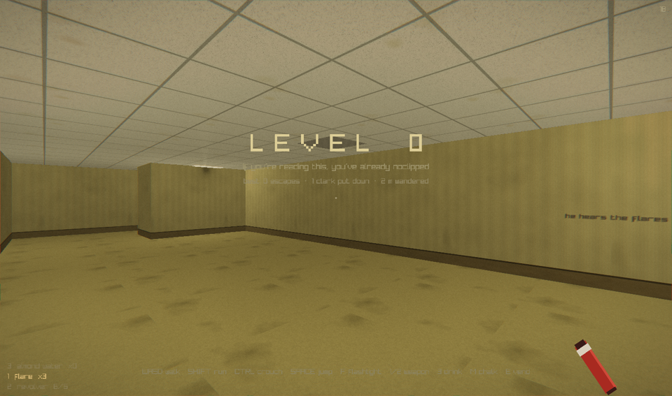
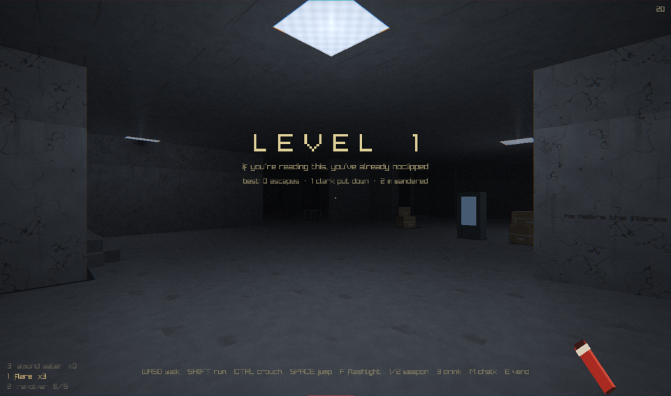
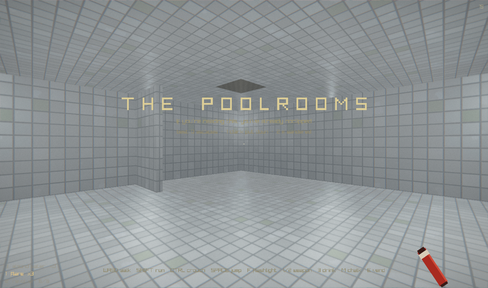
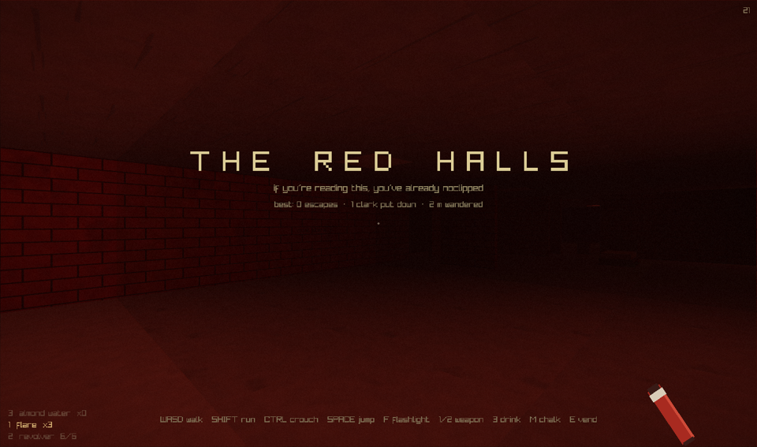
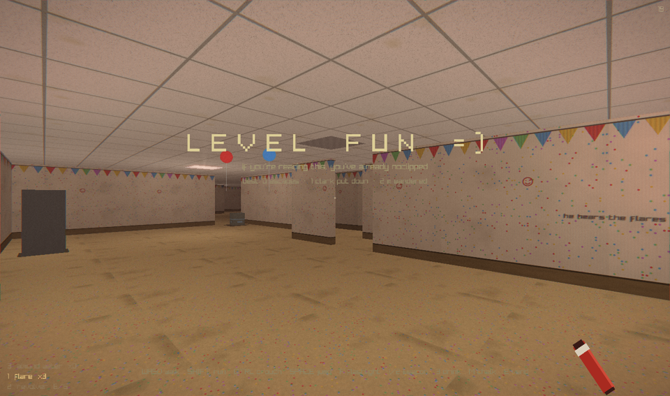
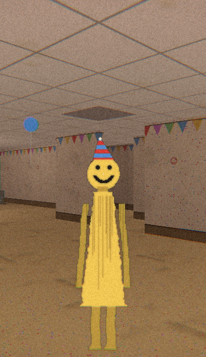
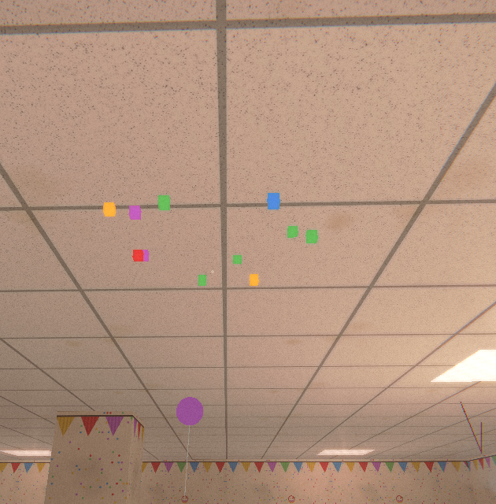

# THE BACKROOMS — Level 0

Disclaimer: Just for fun, initial shell generated with Claude Fable

A native, procedurally-infinite backrooms horror game in a small C++ codebase.
No assets — every texture and every sound is synthesized at startup.


## The levels

Five procedurally-generated levels, each with its own palette, lighting,
soundscape, and things that live there. Exits lead deeper — usually.

| | |
|---|---|
|  **LEVEL 0** — yellowed office maze, humming fluorescents, mustard carpet. Home of Pirate Clark. |  **LEVEL 1** — cavernous concrete warehouse, sparse lights, loading docks. |
|  **THE POOLROOMS** — endless white tile and still water. No blackouts, no exit in a hurry. |  **THE RED HALLS** — oppressive dark-red brick, someone's abandoned bedroom furniture. |
|  **LEVEL FUN =)** — the party that never ended: bunting, balloons, confetti, and a resident who is very glad you came. | |

The wandering entity — **Pirate Clark** in most halls, **the Partygoer =)**
in LEVEL FUN — stalks out of the fog, and gives chase if you stare too long.

<p align="center"></p>

## Build & run

Requires [raylib](https://www.raylib.com) 5.x (`brew install raylib` on macOS;
any distro package or pkg-config install works on Linux).

```sh
make run
```

## Code layout

| module | what lives there |
|---|---|
| `src/main.cpp` | entry point: init, frame loop, shutdown |
| `src/game.*` | run state (`Game` struct) + per-frame update logic, in frame order |
| `src/render.cpp` | 3D scene pass, weapon viewmodel, HUD, overlays |
| `src/world.*` | infinite maze: chunk generation, mesh baking, collision, line of sight |
| `src/levels.*` | per-level look/feel tables (fog, lights, palette) + exit rotation |
| `src/entity.h` | PIRATE CLARK's state (the state machine runs in `Game::updateEntity`) |
| `src/textures.*` | every surface, synthesized at startup |
| `src/sfx.*` | one-shot sounds (footsteps, gunshot, splash, ...) |
| `src/audio.*` | streaming ambience synth (hum, drone, water, the music box) |
| `src/shaders.*` | world + post-process GLSL |
| `src/util.*` | hashes, RNG, value noise, shared palette |

## How it works

- **Infinite world** — deterministic chunk generation (32 m chunks, hashed from
  a world seed): wall runs with doorway gaps, pillars, all baked into 3 meshes
  per chunk. Chunks stream in around you and unload behind you.
- **Lighting** — ceiling lights sit on a global 8 m grid, so the fragment shader
  computes the 9 nearest fluorescents *procedurally* — zero light data. A hash
  decides which tubes are dead and which strobe. Periodic blackout events kill
  the whole floor.
- **Audio** — one continuously synthesized stream: 120 Hz fluorescent hum with
  harmonics, low room tone, and a growl that swells when something is near.
  Footsteps are generated noise-burst samples.
- **Clutter** — cardboard box stacks, filing cabinets, folding tables, and
  collapsed ceiling tiles (with the dark hole they left behind), all placed by
  the same deterministic generator and all solid.
- **PIRATE CLARK** — spawns out in the fog and stands there: tricorn hat, one
  glowing eye, a hook, a peg leg. Line-of-sight is ray-marched against real
  wall geometry. Stare too long and he chases. He is slightly slower than your
  sprint. Your sprint is finite.
- **Flares** — throw one (Q, or left click when selected) and it arcs,
  clatters off walls, and burns orange for nine seconds — a real point light
  in the shader, with a synthesized strike-and-hiss. Clark won't come near
  fire: catch him in the glow and he bolts. You carry three; you find another
  in your coat every so often. Water puts them out.
- **Revolver** — select with 2 (or the mouse wheel). Six rounds, R to reload
  (the gun dips while the cylinder's out), synthesized gunshot, muzzle flash
  that lights the hall. Hits stagger Clark; three put him down — the halls
  stay quiet for a couple of minutes, then something out in the fog stands
  back up. With the flare selected you carry it in hand, cap out, ready to
  strike.
- **Terrain** — Level 0 sinks into carpeted conversation pits, Level 1 raises
  concrete loading docks, and the pools get proper steps down into the water.
  Real stair geometry, smooth step physics — and you can jump onto most of
  the furniture and walk across it.
- **Windows** — rarely, a wall has one. There is nothing on the other side.
- **Furniture** — beyond the office clutter: couches, armoires, floor lamps,
  nightstands, and the occasional bare mattress, arranged by no one, for
  no one.
- **Exits** — vanishingly rare glowing doorways carved into wall runs. Finding
  one "ends" the run. Sort of.
- **LEVEL FUN =)** — the poolrooms exit doesn't lead home. Bunting on every
  wall, confetti trodden into the carpet, crayon smileys, balloons nosing
  against the ceiling tiles, crepe streamers, presents wrapped in party
  colours, and party tables set with a cake nobody ever cut — the candles
  are still lit, and they stay lit through the blackouts — while a music
  box grinds through the birthday song half a semitone flat, forever.
- **Post** — film grain, vignette, chromatic aberration, and a mains-frequency
  luma shimmer, all scaling with fear.

## The little things

Details that reward paying attention:

- **The Partygoer =)** — LEVEL FUN has its own resident: pale yellow, a
  painted-on smile, a striped party hat. It stalks and chases like Clark,
  and the danger banners change to match.
- **Balloons pop** — shoot a balloon in LEVEL FUN and it bursts with a
  synthesized pop and a scatter of confetti cubes that tumble to the carpet.

  <p align="center"></p>
- **Footsteps in the dark** — when the entity chases, you *hear* it: heavy
  footfalls, panned to its bearing and fading with distance, even around
  corners you can't see past.
- **The floor is a lie** — Level 0 has rare soft, dark patches of carpet.
  Linger on one and it gives way — you drop through into Level 1.
- **Cursed exits** — roughly one exit door in six glows red instead of warm.
  Those don't lead deeper. They lead to the Red Halls.
- **Wall scrawl** — earlier wanderers left messages. *NO CLIP.* *day 407.*
  *the exit lies.* *he hears the flares.* Drawn procedurally, pressed into
  the walls, rare enough to unsettle.
- **Muzzle smoke** — powder haze curls off the revolver and drifts up after
  each shot.
- **Camera feel** — the view leans into your strafes and the knees absorb a
  landing.

## Controls

| key | action |
|---|---|
| WASD | walk |
| mouse | look |
| SHIFT | sprint (stamina) |
| CTRL | crouch |
| SPACE | jump |
| F / right click | flashlight |
| 1 / 2 / wheel | select weapon (flare / revolver) |
| left click | use selected weapon |
| Q | throw flare (always) |
| R | reload revolver |
| 3 | drink almond water |
| M | chalk a floor mark |
| E | vending machine |
| F11 | borderless fullscreen |
| ESC / click | release / capture mouse |
| F3 | debug HUD |

## Dev/testing knobs

With the F3 debug HUD open, dev hotkeys are live: `B` force blackout,
`E` spawn Clark stalking ahead, `C` force a chase, `H` despawn him,
`G` refill flares + ammo, `N` jump to the next level (including the Red Halls).

- `BACKROOMS_SHOT=out.png` — run 600 frames headlessly, save a screenshot, exit.
- `BACKROOMS_EXITS=1` — exit doors everywhere (visual testing).
- `BACKROOMS_POS="x,z,yaw"` — start at a specific spot (visual testing).
- `BACKROOMS_LEVEL=n` — start on level n (visual testing).
- `BACKROOMS_SEED=n` — fix the world seed (repeatable maze).
