# THE BACKROOMS

### ▶ [Play it in your browser](https://domcampese.github.io/backrooms-game/)

No install, no download. Works on a phone — touch controls appear automatically.

Disclaimer: just for fun, mostly generated with Claude models

A procedurally-infinite backrooms horror game in a small C++ codebase, running
natively and on WebAssembly. Procedural worlds and sound, with an animated CC0
revolver and compact texture assets embedded at build time.

## License and credits

This unofficial hobby game is released under **GNU GPLv3**. See [LICENSE](LICENSE)
and [Credits and third-party notices](CREDITS.md) for the full terms, Backrooms
wiki author acknowledgments, and the separate licenses for adapted lore and assets.
Thanks to the Backrooms community, especially 1000dumplings and the other authors
credited there, for the shared lore behind Smilers, Partygoers, Level Fun, the Poolrooms and Almond Water.

The software is provided without warranty. Source and build instructions are
available in this repository; released builds must include access to their
corresponding source. This project is not affiliated with or endorsed by the wiki
or other Backrooms creators.

## Play it in a browser

**https://domcampese.github.io/backrooms-game/**

The game compiles to WebAssembly and runs on WebGL 2. Every push to `main`
publishes it to GitHub Pages via `.github/workflows/pages.yml`, which runs the
same `tools/web-build.sh` you would run locally.

```bash
source /path/to/emsdk/emsdk_env.sh   # emscripten on PATH
tools/web-build.sh                   # -> web/dist/index.{html,js,wasm}
cd web/dist && python3 -m http.server 8099
```

The first run compiles raylib for the browser from the tag the script pins; it
is cached in `.raylib-web/` afterwards. Both are gitignored.

The dev knobs are URL query parameters rather than environment variables:
`?seed=1337`, `?level=2`, `?pos=95,79,1.2`, `?flash=1`, `?exits=1`,
`?noblackout=1`. Pass `noblackout=1` for any screenshot — there is no
`BACKROOMS_SHOT` on the web to turn blackouts off for you, and a capture that
lands in one is a black frame that looks exactly like a failed shader compile.

Records are kept in IndexedDB rather than `$HOME`, so they survive a reload but
are per-browser.

### On a phone

Touch controls appear automatically on a coarse pointer: a floating thumbstick
in the lower left (push it all the way to run), drag anywhere else to look, and
a button cluster for fire, aim, reload, jump, use, torch, item, throw, chalk and
drink. Force them on or off with `?touch=1` / `?touch=0`.

**Tap anywhere to begin**, or just push the stick — the title card and the
death card both start a run on any tap of open screen, and a stick push starts
one with you already walking. Hunting for one small button in a corner was the
only way in before. Both are edges rather than held states, so a thumb still
resting on the stick when you die cannot dismiss the death card before you have
read it.

**Sprint is a push past the ring**, not a hard shove inside it — the drawn edge
of the thumbstick is the line, so you can see where it is. The ring lights up
while you are running. Sprint is currently unlimited — the stamina meter is
still drawn and still recovers, but nothing drains it. (`SPRINT_DRAIN` in
`updateSprint` puts the limit back: it was a 16 second tank against 6 seconds
to recover.)

**Look sensitivity** is set so one thumb drag across the screen turns you about
half way round; it was a quarter turn, which made looking behind you a four-swipe
job. `tools/mobile-check.mjs` asserts the resulting degrees-per-drag rather than
the constant, since the game's own rad-per-pixel is the other half of it.

**AIM taps** rather than holds: one tap raises the sights, another drops them.
Holding it is what a mouse does, and it asks the right thumb to stay parked on
one button for the length of a gunfight — leaving nothing to fire with. The
latch belongs to the game, not to the button, so anything that makes the aim
illegal drops it, and tapping LOAD lowers the sights first (a reload cannot
start while they are up).

They are drawn by the page, not the game; `src/input.h` folds them into the same
input questions the desktop build asks, so the game itself does not know which
it is running on.

`node tools/mobile-check.mjs` loads `web/shell.html` in Chromium at seven phone
and desktop sizes and asserts the things a screenshot of the world will never
show you: that no two on-screen controls overlap, that the splash fits or
scrolls with ENTER on screen, that the canvas keeps its aspect ratio whatever
size raylib gives it, and that the title-screen gestures resolve correctly — a
tap or a stick push begins a run, a button press or a look drag does not.


## Model asset pipeline

Prepared `.glb` models use Raylib's standard model and animation loaders through
`ModelAsset`. Add models under `assets/models`; build-time packaging discovers them
automatically. See [the asset workflow and validation](docs/model-pipeline.md).

## Object realism pass

The held revolver uses a complete CC0 model by loafbrr_1, with authored textures,
normal detail, and firing/reload animation. It retains the six-shot mechanics and
fits the existing wall-clearance envelope. [Import details and screenshots](docs/revolver-import.md)
and [source/license](assets/revolver/README.md).

Wood and fabric furniture has softened
edges. Scanned metal, wood, and upholstery feed the existing shared prop atlas;
object gloss is independent of each level's floor gloss.

The external tiles add about 45 KB compressed, are embedded in the executable,
and need no runtime downloads. [Sources and licensing](assets/materials/README.md).
Python 3 is required at build time to embed them; no additional Python libraries
are needed. See [validation](docs/object-realism-pass-two.md).

## Graphics update

The renderer now uses generated, mipmapped surface-detail maps, recessed fluorescent
housings, and physical baseboard trim. Tile grout reduces gloss independently of the
glaze. Flashlight haze is kept faint so the illuminated surfaces remain readable.
The revolver and flare are 3D, including recoil, reload dip, and muzzle effects;
held almond water sits lower and is smaller. Model transforms now also transform lighting
positions and normals, correcting misplaced lighting on cans and tape decks.

Furniture has separate wood and fabric atlas regions, cushion seams, cabinet handles,
wardrobe panels, round lampshades and cooler bottles, and leaf geometry. Post-processing
uses less grain and chromatic aberration, with 12 bloom taps instead of 20. Visible chunks
are culled against the camera and opaque chunks draw near-first.

Chalk marks are directional arrows. Exhausted sprinting waits for recovery instead of
oscillating between running and walking; a new run restores stamina. Footsteps and distance
records follow actual travel. Full batteries remain available to collect later.

See [validation and limitations](docs/graphics-update.md).


## The levels

Five procedurally-generated levels, each with its own palette, lighting,
soundscape, and things that live there. Exits lead deeper — usually.

| | |
|---|---|
| 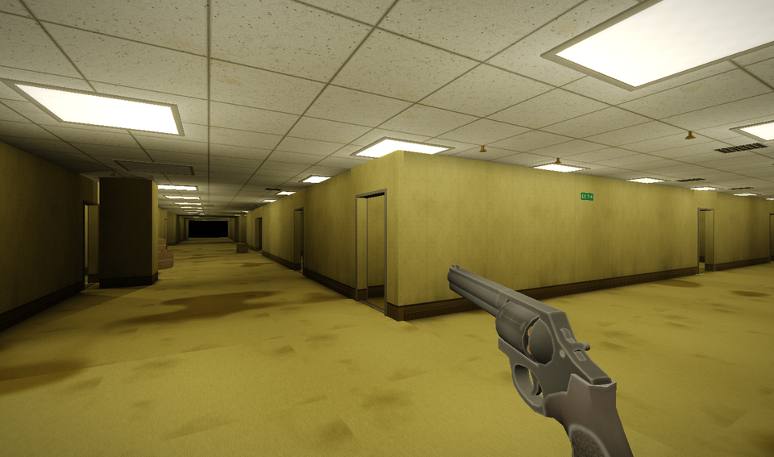 **LEVEL 0 · THRESHOLD** — empty rooms, mono-yellow chevron wallpaper, sodden carpet, a humming, uneven grid of tubes, stairs up to floors that look exactly like this one and railed openings down to more of them, and no way out but through a wall. Home of Pirate Clark. | 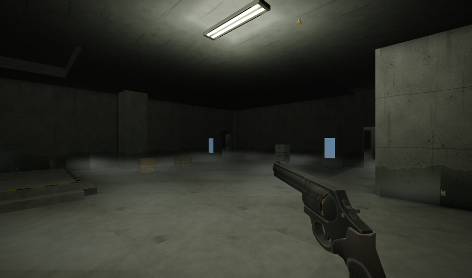 **LEVEL 1 · HABITABLE ZONE** — a concrete warehouse under dim, failing tube lights, fog lying on the slab, exposed rebar, supply crates that move in the blackouts, and doors marked with symbols. Where a Smiler waits in the dark. |
| 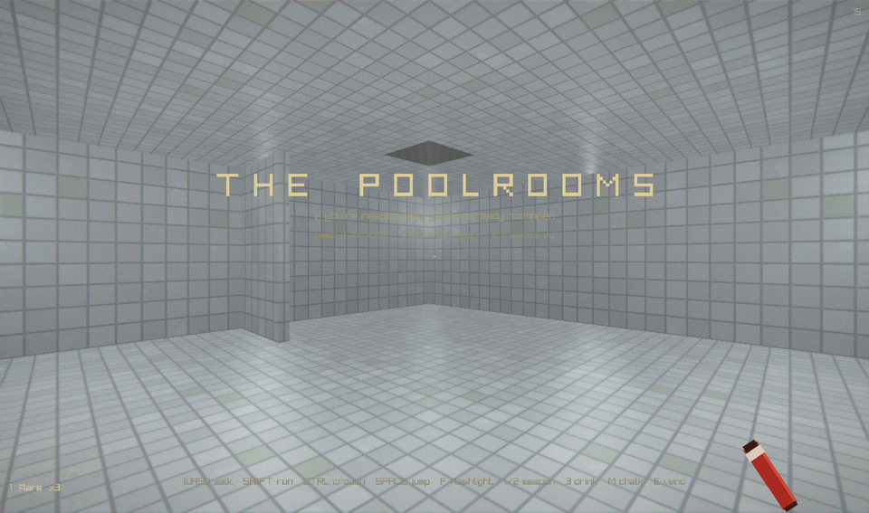 **THE POOLROOMS** — endless white tile and still water: colonnaded halls, flooded tunnels, staircases sinking into deep water, windows onto white light. No blackouts, no exit in a hurry. | 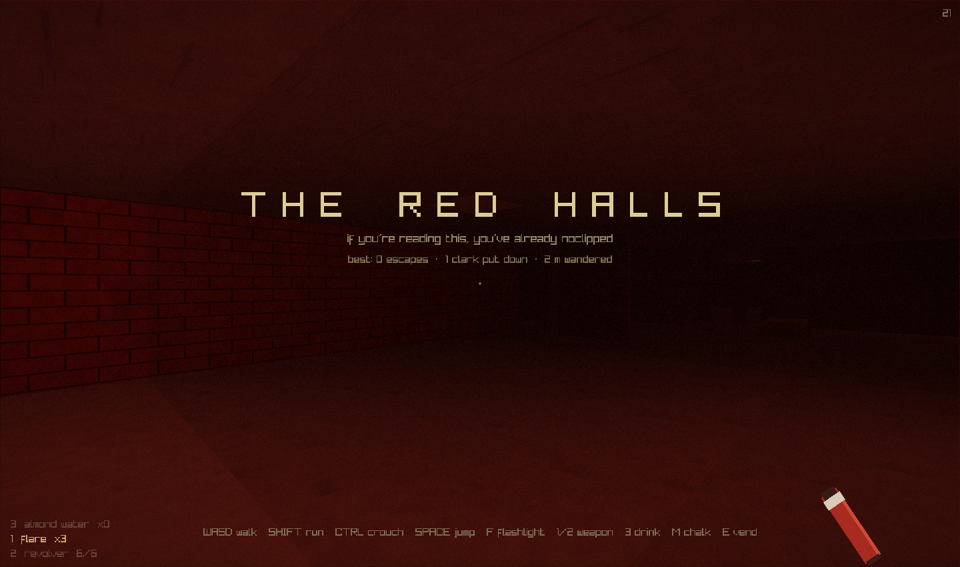 **THE RED HALLS** — oppressive dark-red brick, someone's abandoned bedroom furniture. |
| 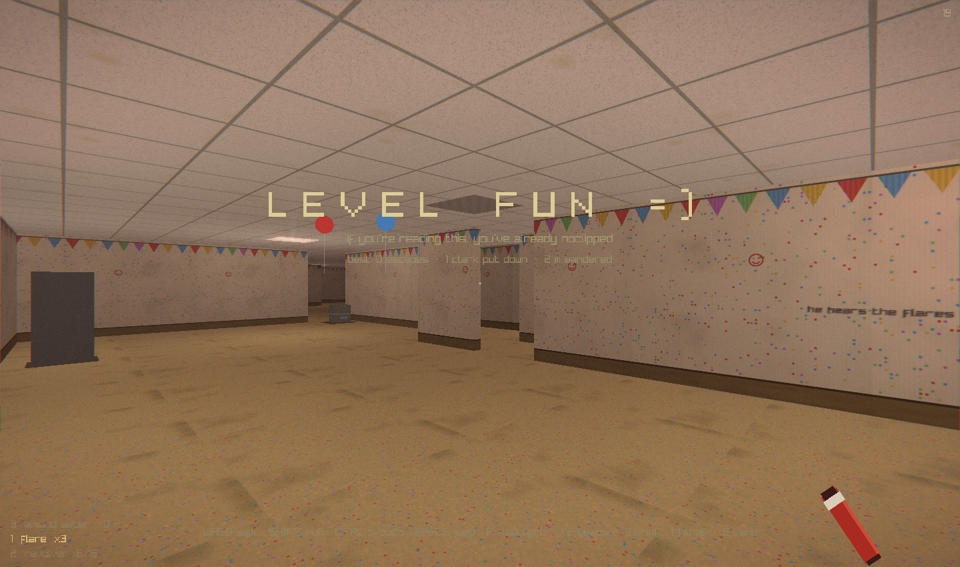 **LEVEL FUN =)** — the party that never ended: deep red carpet, a ceiling gone black so the lights hang like a party hall's, bunting, balloons, party tables, and a resident who is very glad you came. | |

The wandering entity — **Pirate Clark** on Level 0, **a Smiler** on Level 1 and in the Red Halls, **the Partygoer =)**
in LEVEL FUN — stalks out of the fog, and gives chase if you stare too long.

<p align="center">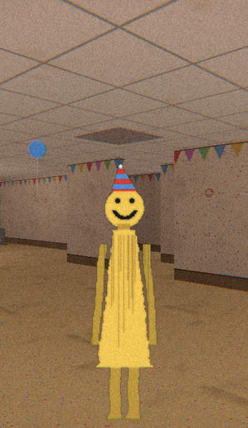</p>

## Build & run

Requires [raylib](https://www.raylib.com) 5.x (`brew install raylib` on macOS;
any distro package or pkg-config install works on Linux).

```sh
make run
```

## Code layout

| module | what lives there |
|---|---|
| `src/main.cpp` | entry point: init, frame loop, shutdown |
| `src/game.*` | run state (`Game` struct) + per-frame update logic, in frame order |
| `src/render.cpp` | 3D scene pass, weapon viewmodel, HUD, overlays |
| `src/world.*` | infinite maze: chunk generation, storeys and the stairs between them, mesh baking, collision, line of sight |
| `src/levels.*` | per-level look/feel tables (fog, lights, palette) + exit rotation |
| `src/entity.h` | the hunter's state — Clark, the Smiler or the Partygoer by level (the state machine runs in `Game::updateEntity`) |
| `src/textures.*` | every surface, synthesized at startup |
| `src/sfx.*` | one-shot sounds (footsteps, gunshot, splash, ...) |
| `src/audio.*` | streaming ambience synth (hum, drone, room); water and LEVEL FUN music are recordings |
| `src/shaders.*` | world + post-process GLSL |
| `src/util.*` | hashes, RNG, value noise, shared palette |

## How it works

- **Infinite world** — deterministic chunk generation (32 m chunks, hashed from
  a world seed): wall runs with doorway gaps, pillars, all baked into 3 meshes
  per chunk. Chunks stream in around you and unload behind you.
- **Storeys** — Level 0 is a stack of whole floors, 4.32 m apart, joined by
  enclosed dogleg stairwells, straight flights rising through openings in the
  ceiling, and double-height halls railed round on the floor above. Every floor
  is its own maze, generated from its own seed. The one you stand on is always
  at y = 0, so collision, pathfinding, sight lines and the shadow march stay
  two-dimensional; the floors above and below are drawn a storey up or down,
  and only through an opening you can see. Walk past the middle of a flight and
  the world re-bases by one storey under you. The stairs, openings and the
  rails round them are a pure function of the chunk and the two floors they
  join, so both floors build the same stairwell without ever reading each
  other. Light falls down the openings from the tubes above, stairwells have a
  batten on the half landing, Clark follows you up the stairs, and a drop over
  a railing hurts.
- **Lighting** — ceiling lights sit on a global 8 m grid, so the fragment shader
  computes the 9 nearest fluorescents *procedurally* — zero light data. A hash
  decides which tubes are dead and which strobe. Periodic blackout events kill
  the whole floor.
- **Light actually stops at walls** — every source in the game is occluded by
  real geometry: the fluorescents, your flashlight, a burning flare, the muzzle
  flash. The trick is that each floor of this maze is a 2D floorplan extruded
  floor-to-ceiling, so "can this light reach this point" is a *2D* question. The cells around you
  are packed into a small byte grid (one bit per wall edge, one for pillars) and
  uploaded as a texture; the fragment shader runs a DDA across it, testing the
  wall edge it crosses at each step. No shadow maps, no light volumes, no extra
  passes — one 64×64 texture and a loop.

  Everything falls out of that for free: rooms you haven't lit stay dark, light
  pours through doorways in shafts, pillars throw shadows across the floor, and
  your torch beam stops dead at a corner instead of shining through it. Doorways
  and window glass simply aren't in the grid, so light streams through them.
- **Soft shadows, and no black holes** — a ceiling panel is a metre-wide strip,
  not a point, so each one is traced from both ends and averaged: shadow edges
  land soft, the way a real fluorescent casts them. And a wall blocks the *direct*
  beam only — a fixed fraction still gets through to stand in for the light that
  bounces around it, because a real room next to a lit one is never pitch black.
  Net effect on the frame is a wider dynamic range, not a dimmer picture.
- **The thing casts a shadow** — catch the hunter in your flashlight or a flare
  and it throws its own silhouette down the hall. It's treated as a body rather
  than a column, so a beam that clears its head still lights the ceiling behind.
- **Audio** — one continuously synthesized stream: 120 Hz fluorescent hum with
  harmonics, low room tone, and a growl that swells when something is near.
  Footsteps are generated noise-burst samples.
- **The buzz is the level** — canon is explicit that the hum is "notably louder
  and more obtrusive than ordinary fluorescent lights" and that it gives you
  migraines that outlast the building, so it is mixed to be the thing you
  remember about Level 0 and are relieved to get away from. Two fundamentals sit
  0.6 Hz apart and beat against each other about twice a second, which is what
  stops the ear filing it away; standing under a live fitting swells it. In a
  blackout it does not simply stop — what is left underneath is a thin high
  ring, which is worse than silence.
- **Rooms sound like rooms** — a Schroeder reverb on the ambience bus, its decay
  and its wet/dry riding the mean open run measured around you, so a corridor
  and a warehouse hall stop being acoustically identical. The two allpass chains
  differ left to right, which is also the first stereo width the stream has had.
- **Sound knows about walls** — every positional one-shot has a second,
  through-a-wall version: two poles of low-pass, a softened transient, a level
  drop and a harder distance rolloff, picked on line of sight at the moment it
  plays. On Level 0 a point 20 m away is occluded most of the time, so this is
  most of what you actually hear — and it is the difference between knowing
  something is near and knowing *where*.
- **Clutter** — cardboard box stacks, filing cabinets, folding tables, and
  collapsed ceiling tiles (with the dark hole they left behind), all placed by
  the same deterministic generator and all solid.
- **PIRATE CLARK** — Level 0's hunter: tricorn hat, one glowing eye, a hook,
  a peg leg.
- **THE SMILER** — Level 1 and the Red Halls, true to the [Backrooms lore](https://backrooms.fandom.com/wiki/Entity_3):
  no body you can pin down, just a shape of darker dark with two glowing eyes
  and a grin of teeth that carries its own light, so it shows first in an unlit
  corridor. Lights die around it. Line-of-sight is ray-marched against real
  wall geometry.
- **All three hunters** — Clark, the Smiler and the Partygoer — share one
  brain: stare too long and they chase, slightly slower than your sprint.
  You can survive one landed lunge (or dog bite), but a second
  before you've recovered kills you. Health starts coming back after 6 seconds
  untouched and is full again about 10 seconds later.
- **He walks** — a six-frame stride, generated by the same procedural code that
  draws him, driven by the distance he has actually covered so the frame his
  boot lands on is the frame you hear it. One full stride per cycle rather than
  half of one mirrored, because a real leg and a peg leg do not swing the same.
  He bobs, he leans into a chase, and he leans harder into the lunge.
- **And his head comes round** — a second row of the sheet has him looking at
  you instead of down the corridor, and it is selected off the same gaze timer
  that is about to tip him into a chase. When his eye moves to the centre of his
  face, you have already been noticed.
- **He does not always walk out of the fog** — about a third of his arrivals are
  close and already out of your sight: round the corner you are heading for, or
  at the far end of the run you have just decided to walk down. The rest still
  resolve out of the distance, because one fixed ritual replaced by another
  fixed ritual buys nothing.
- **Being caught ends the run** — there is no waking up somewhere else any
  more. He takes you, the run is over, and a card names the level, the time,
  the metres walked and what got you before the title screen comes back. Your
  deepest level and longest run are kept with the other records.
- **...but the grab is telegraphed** — he has to commit from about two and a
  half metres, the commit is announced and lasts a little over half a second,
  and only a commit that is still running can take you. Sprint clear of it and
  he has to back off and set up again. The catch used to be a silent proximity
  test, which is fine when being caught costs nothing and simply unfair when
  it costs the run.
- **He hunts you around corners** — in a chase he beelines while he can see you,
  but the moment a wall breaks his line of sight he routes around it: a breadth-
  first search over the cell grid picks the next turn toward you, so he comes
  through the doorway instead of grinding against the wall you ducked behind.
- **It brings the dark** — the fluorescents die in a pool around the hunter and
  the shadow travels with it, so the corridor ahead goes black as it closes in
  and it stands in its own darkness. Your flashlight and your flares cut
  straight through that pool — they're how you find it. The dread deepens with
  the hunt: a hint of gathering dark while it stalks, full black-out as it
  chases.

  <p align="center">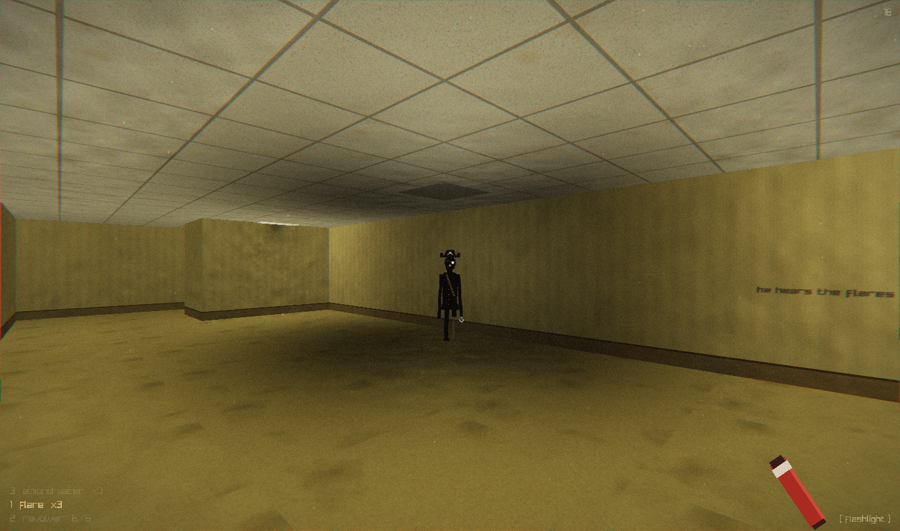</p>
- **Hiding** — crouch (CTRL) in beside real cover — a couch, a filing cabinet,
  an armoire, a desk, shelving, a party table — and the hunt loses you outright,
  however close it gets. It can walk right up and stand there not knowing;
  hold still and it gives up faster than it would out in the open. Get away
  with it and you'll know: *it stood right there, and never saw you.*
- **Flares** — throw one (Q, or left click when selected) and it arcs,
  clatters off walls, and burns orange for nine seconds — a real point light
  in the shader, with a synthesized strike-and-hiss. The hunter won't come near
  fire: catch it in the glow and it bolts. You carry three; you find another
  in your coat every so often. Water puts them out.
- **Revolver** — select with 1 (or the mouse wheel). Hold right mouse for iron sights; release to lower the gun. Six rounds, R to reload after lowering the sights
  (the gun dips while the cylinder's out), synthesized gunshot, muzzle flash
  that lights the hall. A hit rocks the hunter back and costs it a
  moment's speed, but it does not turn it — it tells it exactly where you
  are, and it comes on. Three put it down; the halls stay quiet for a
  couple of minutes, then something out in the fog stands back up. Fire is
  the only thing that makes it break off. With the flare selected you
  carry it in hand, cap out, ready to strike.
- **The flashlight runs on a battery** — it drains while it's on, flickers a
  warning as it dies, and goes dark if you let it run out — you can always
  switch it off, but a dead battery won't switch back on. Spares turn up
  in the world like almond water and doubloons do, and top up a solid chunk
  of charge. Choose when you actually need it.
- **Sanity** — a meter that only ever goes one way on its
  own. It drains the whole time you're down here, faster the deeper you go
  (roughly nine minutes' worth on Level 0, four in LEVEL FUN), faster again
  in the dark or while something is hunting you, and slower when you're
  tucked in and breathing slow. As it slips, the walls start to move on you,
  the whispers come closer together, and eventually you can hear your own
  pulse. The last tenth is a slide you can feel arriving: the corridor narrows,
  the whispers come up out of the walls, and your own pulse crowds out the rest
  of the mix. At zero the place has you, and the run ends with its own card.
  Almond water is the only thing that puts any of it back.
- **And the building stops holding still** — down in that last tenth, doorways
  you came through are walls when you turn round. It only ever closes an edge
  you cannot currently see, and never the last way out of a room, so it reads as
  the place taking you rather than as the maze breaking. The Backrooms is
  canonically non-Euclidean; a perfectly consistent grid was the one thing the
  world model was doing against the source material.
- **Almond water** — a proper aluminium can now: brushed top and base, a
  cream label with the brown band and the almond on it, the wordmark
  wrapping round the curve the way print on a can does, and a little
  stained from however long it's been sitting there. Press 3 and you
  actually drink it — the can comes up, tips right back for three
  swallows, and drops away, and both hands are busy the whole time, so you
  can't shoot your way out of a decision to drink. It steadies you,
  restores your wind, and puts a solid third of your sanity back. They turn
  up on the floor and standing on tables, desks, cabinets and nightstands
  — wherever somebody set one down and didn't come back.
- **Cassette tapes** — rarer finds, scattered through the halls: someone
  else's fragment of the descent, a line of found text and a warble of tape
  hiss when you pick one up. They are what the tape player runs on.
- **The tape player** — a battered field recorder, on 4. Thread one of the
  tapes you've found and press play, and a voice comes up out of the hiss:
  synthesized formants through tape wow and dropouts, garbled just past
  intelligible. The words aren't the point. Someone was here, and while you
  can hear them your sanity climbs back instead of draining — the
  only thing besides a can that gives any of it back, and unlike a can it
  gives it back slowly, for as long as you let the tape run.

  The catch is that a running deck is *loud*. In the Red Halls, where the pack
  hunts by sound, playing a tape in your hand makes you a beacon they can hear
  from thirty metres. So the other thing you can do is press play, then set the
  deck down and walk away: the noise is now over **there**, and so are they.
  They commit to the deck, not to you, and stay on it until the tape runs out.
  You give up the voice to do it: the further the deck is from you, and the
  more wall between, the less it steadies you, and it does nothing at all for
  you past about fourteen metres — which is well inside the range the pack can
  still hear it from. Leave it close enough to keep hearing and they arrive
  where you're standing. The record lamp pulses while it runs, and you fetch it
  back with E.
- **Terrain** — Level 0 sinks into carpeted conversation pits, Level 1 raises
  concrete loading docks, and the pools get proper steps down into the water.
  Real stair geometry, smooth step physics — and you can jump onto most of
  the furniture and walk across it.
- **Windows** — rarely, a Red Halls wall has one, and now you can see through it: a
  translucent glass pane, clear in the middle and catching the light at
  grazing angles, with the next room laid out on the far side.

  <p align="center">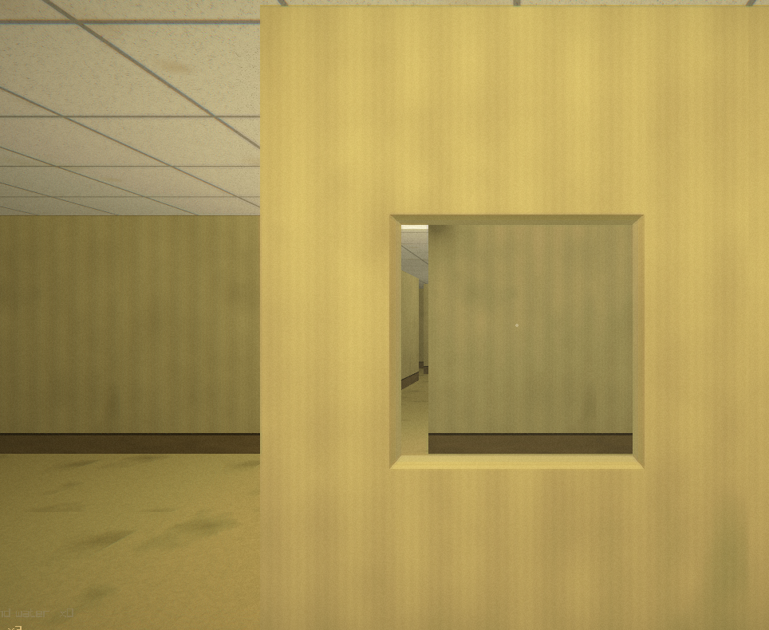</p>
- **Furniture** — couches, armoires, floor lamps, nightstands, party tables
  and the occasional bare mattress, arranged by no one, for no one. All of it
  solid, and most of it climbable. Level 0 has none: the lore's "randomly
  segmented empty rooms" hold only the odd stack of cartons and the ceiling
  tiles that have come down.
- **Level 0, by the book** — mono-yellow chevron wallpaper (the paper in the
  2002 photograph), lay-in troffers crowded into a drop ceiling with a fifth
  of them dead and the rest uneven, clean carpet with visibly rotten patches, and a hum that gives you a migraine
  which follows you out. Glowing white doors lead onward; red doors lead to the
  Red Halls. Connected rooms offer routes around interrupted corridors, and
  occasional courts have 3, 5, or 7 stacked floors overlooking the same void.
- **Level 1, by the book** — the Habitable Zone's warehouse: bare concrete with
  a damp tide line at the foot of every wall and rebar showing where the cover
  has blown off, a low fog lying on the clean floor, and
  twin-tube battens, three in ten of them dead. Supply crates stand about with
  something useful inside — or crayons, shoelaces, loose change — and after
  every blackout they are somewhere else. The ways on are steel doors with a
  symbol painted over each, and nobody has ever seen the lifts come.
- **The Manila Room** — walk far enough and you may find it: an 8 m square room
  with manila wallpaper, wooden floorboards, a door on each wall, an octagonal
  table with two chairs under a chandelier, almond water in the cupboard and
  notes left by the wanderers before you (E to read). The hum goes quiet
  inside, your grip comes back, and the notes chalk you a way out.
- **Another floor down** — Level 0 rarely opens into a grand atrium: the
  carpet falls away in broad terraces, half a metre a ring, down to a hall
  two and a half metres below the office, with real stairs at every edge and
  the walls above reading as balconies. The warehouse stacks its loading
  docks two tiers high. There was always another floor.
- **The Red Halls have pipework** — service runs of rusted iron and dull steel
  follow the corridors just under the ceiling, with collars every few metres.
  Runs are decided per corridor rather than per cell, so a pipe follows a wall
  the whole way instead of appearing in patches.
- **The pack hunts by sound, and only sound** — furniture is nothing to them in
  either direction: standing dead still in the open loses them, and crouching
  behind a cabinet with a tape running in your coat does not. Putting the deck
  down somewhere else is the play.
- **The pack** — the Red Halls have their own residents, and they don't hunt
  the way Clark and the Smiler do. They hunt by sight: stare at it and it comes. **The
  dogs hunt by sound.** Sprinting carries, a gunshot carries a long way, a
  struck flare carries — crouching and standing still barely carries at all.
  Prowling, they nose around the halls on their own business; hear you and they
  commit, and they are faster than you are, so running is never the answer.
  Fire turns them, a bullet puts one down, going quiet makes them lose the
  thread — and a tape player left running somewhere else takes them there
  instead. You hear them before you see them: barks panned to whichever one
  spoke, and the pack calling to each other across the dark.
- **Shutting off the pipes** — three standpipes in the Red Halls carry a
  seized shut-off wheel. Turn all three (E at each) and the pipes go quiet and
  the halls give up the cache they were holding — a spill of doubloons, which
  is the currency you need to leave for good. The wheels read red while open
  and green once shut, so you can see at a glance which ones you've found.
- **Exits** — glowing doorways carved into wall runs. A normal one takes you
  one level deeper (and ~1 in 6 is cursed: it glows red and drops you into the
  Red Halls instead).
- **Getting out for good** — the doubloons a hunter leaves when you put it
  down are your ticket. Bank enough of them and the honest doors start to burn
  green: step through one and you *escape the backrooms* — a real win, timed and
  recorded. But doubloons also buy almond water from the vending machines, so
  every coin is a choice between surviving now and leaving later, and you have
  to fight the hunters to earn your way out at all.

  <p align="center">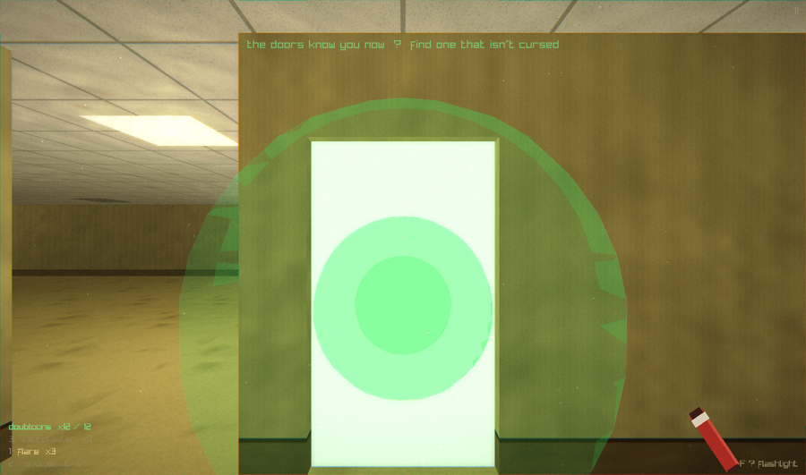 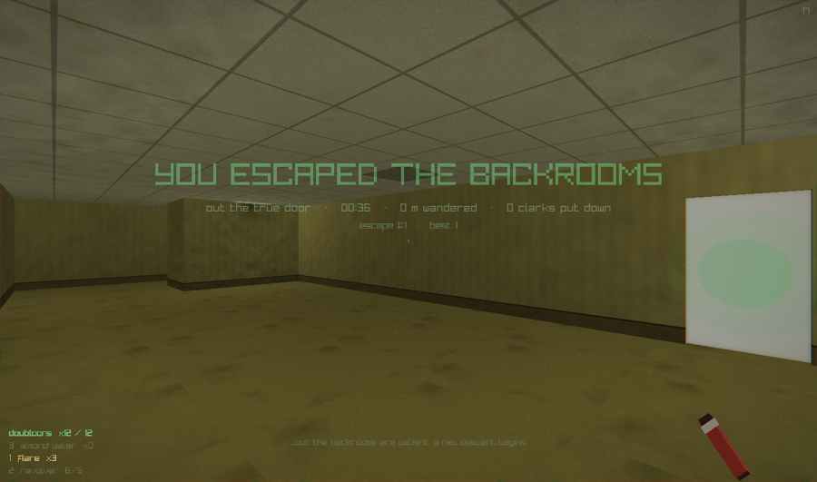</p>
- **LEVEL FUN =)** — the poolrooms exit doesn't lead home. Deep red banquet
  carpet with confetti ground into it, a ceiling gone black so the fluorescent
  panels hang like a darkened party hall's, bunting on every wall, crayon
  smileys, balloons nosing the ceiling, crepe streamers, presents wrapped in
  party colours, and party tables laid with paper cups, a cake nobody ever
  cut, and balloon bunches knotted to the cloth — the candles are still lit,
  and they stay lit through the blackouts — while a party loop plays somewhere
  too slow and too flat, wandering in pitch like a tape on a dying motor.

  <p align="center">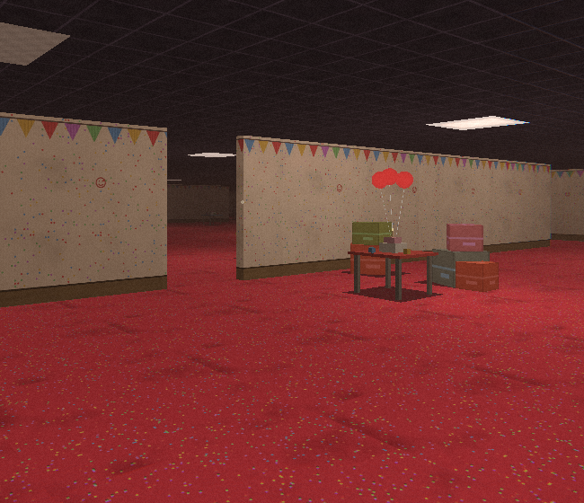</p>
- **Surface relief** — generated mipmapped maps follow material UVs. Ceramic
  joints have recessed relief and reduced gloss; smooth objects opt out.
- **Baked ambient occlusion** — soft contact shadows are baked into every
  chunk's geometry as gradient decals: along each wall's base and ceiling
  crease, creeping up the skirting, around every pillar's feet and head. Walls
  sit *in* the room instead of on top of it, and it costs nothing per frame.
- **Post** — threshold bloom that makes the fluorescents actually glow, a gentle
  filmic contrast + saturation lift, plus
  film grain, vignette, chromatic aberration, and a mains-frequency luma
  shimmer — the fear-driven ones scale as the fear does.
- **Title screen** — a drifting camera pans across a fresh hall behind the card:
  *THE BACKROOMS*, a pulsing *press any key to descend*, your best run so far,
  and the controls. Any key or click drops you in from the top.

## The little things

Details that reward paying attention:

- **The Partygoer =)** — LEVEL FUN has its own resident: pale yellow, a
  painted-on smile, a striped party hat. It stalks and chases like Clark and the Smiler,
  and the danger banners change to match.
- **Balloons pop** — shoot a balloon in LEVEL FUN and it bursts with a
  synthesized pop and a scatter of confetti cubes that tumble to the carpet.
  The bunches knotted to party tables pop too — clip any one and the whole
  bunch goes at once.

  <p align="center">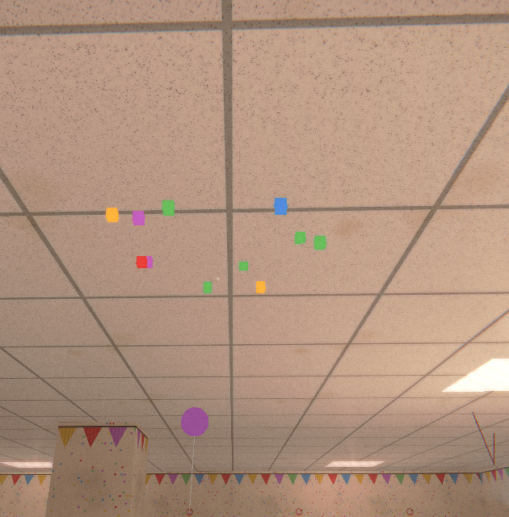</p>
- **Footsteps in the dark** — when the entity chases, you *hear* it: heavy
  footfalls, panned to its bearing and fading with distance, even around
  corners you can't see past.
- **Some doors are shut** — about one chunk in three has a door with a leaf
  still in it, locked, and its key lying loose within a few metres on the side
  you can already reach. Behind it is either a closet worth opening or a
  shortcut. `E` / `USE` turns the key, and the door stays open.
- **The floor is a lie** — Level 0 has rare soft, dark patches of carpet.
  Linger on one and it gives way — you drop through into Level 1.
- **Cursed exits** — roughly one exit door in six glows red instead of warm.
  Those don't lead deeper. They lead to the Red Halls.
- **Wall scrawl** — earlier wanderers left messages. *NO CLIP.* *day 407.*
  *the exit lies.* *he hears the flares.* Drawn procedurally, pressed into
  the walls, rare enough to unsettle.
- **Muzzle smoke** — powder haze curls off the revolver and drifts up after
  each shot.
- **Camera feel** — the view leans into your strafes and the knees absorb a
  landing.

## Controls

| key | action |
|---|---|
| WASD | walk |
| mouse | look |
| SHIFT or double-tap W | sprint |
| CTRL | crouch |
| C (hold) | squeeze through narrow gaps; release in open space to straighten up |
| SPACE | jump / hold to stay up while swimming (let go to dive) |
| F / L | flashlight |
| hold right mouse | revolver iron sights (release to lower; no reload while aiming) |
| 1 / 2 / 4 / wheel | select item (revolver / flare / tape player) |
| left click | use selected weapon |
| Q | throw flare (always) |
| R | reload revolver |
| 3 | drink almond water |
| 4 | tape player (click to play a tape; click again to set it down running) |
| M | chalk a directional floor arrow |
| E | vending machine, or pick the tape player back up |
| F11 | borderless fullscreen |
| P | pause |
| ESC / click | release / capture mouse |
| F3 | debug HUD |

## Dev/testing knobs

With the F3 debug HUD open, dev hotkeys are live: `B` force blackout,
`E` spawn the level's hunter stalking ahead, `C` force a chase, `H` despawn it,
`G` refill flares + ammo, `N` jump to the next level (including the Red Halls),
`PageUp`/`PageDown` up or down a storey where you stand (Level 0).

- `BACKROOMS_SHOT=out.png` — run headlessly, save a screenshot, exit.
- `BACKROOMS_SHOTFRAME=n` — which frame that screenshot is taken on (default 600).
  Lower it to sweep the game quickly; the software renderer is slow.
- `BACKROOMS_MENU=1` — hold on the title screen (skips the auto-start; visual testing).
- `BACKROOMS_EXITS=1` — exit doors everywhere (visual testing).
- `BACKROOMS_MANILA=1` — a Manila Room in the chunk east of spawn, centred at x 48, z 16 (visual testing).
- `BACKROOMS_POS="x,z,yaw"` — start at a specific spot (visual testing).
- `BACKROOMS_LEVEL=n` — start on level n (visual testing).
- `BACKROOMS_SEED=n` — fix the world seed (repeatable maze).
- `BACKROOMS_STOREY=n` — start on storey n of Level 0 (0 is the floor you wake on).
- `BACKROOMS_NOBLACKOUT=1` — never schedule a blackout. Defaults to on whenever
  `BACKROOMS_SHOT` is set, because blackouts run on the wall clock and a headless
  capture is slow enough to land inside one; pass `0` to capture a blackout
  deliberately. The F3 `B` key still forces one either way.

### Native regression tools

`tools/shot.sh` and `tools/sweep.sh` run natively on macOS and use Xvfb on Linux.
Capture logs are retained and shader failures stop the scripts.

- `BACKROOMS_CLEAN=1`: omit gameplay HUD and introductory fade in captures.
- `BACKROOMS_TIME=4`: fix rendering time (does not freeze gameplay or menu movement).
- `BACKROOMS_BENCH=1`: disable vsync and report mean, median and p95 frame times
  after 60 warmup frames; skip the forced screenshot-test enemy spawn.
- `BACKROOMS_BIN=/absolute/path`: select a binary for `tools/shot.sh`.

`make regression` checks sprint recovery, restart reset, battery retention, that
a doorway's jambs and a locked door actually stop a body, and that neighbouring
storeys agree about every stair and opening (a flight climbed and descended by the
real mover, Clark following, a fall through an atrium), then
captures held-item, navigation and storey views in `shots/regression`. It needs a display.
`tools/bench.sh /absolute/baseline /absolute/new 2 3` interleaves runs and retains logs;
legacy binaries report total runtime only. Automated captures do not save player records.

Revolver rounds travel through the world and stop at the first surface or target, with a brief trail and impact debris. On touch devices, hold **SQUEEZE** while moving the stick to pass through narrow gaps.

### Poolrooms and swimming

The Poolrooms draw on [Level 37: Sublimity](https://backrooms-wiki.wikidot.com/level-37): pristine ceramic, blue-green water, broad tiled arches, oversized colonnaded halls, flooded tunnels, underwater staircases, windows into a light void, and quiet isolation. The game retains its five-level progression; this is the Poolrooms destination within it. No entities spawn here, and your grip slowly recovers.

Pools have shallow shelves and deep centres. In deep water, hold **SPACE** to swim up and stay at the surface; let go and you sink, which is how you dive. **SHIFT** swims faster. On touch screens hold **JUMP**. Swim toward a shelf at the surface to climb out; submerged risers remain solid. There is no breath timer in this refuge.

See [the Poolrooms implementation and visual checks](docs/poolrooms.md).
