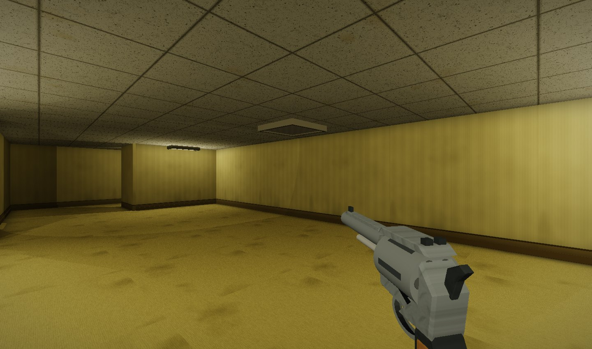
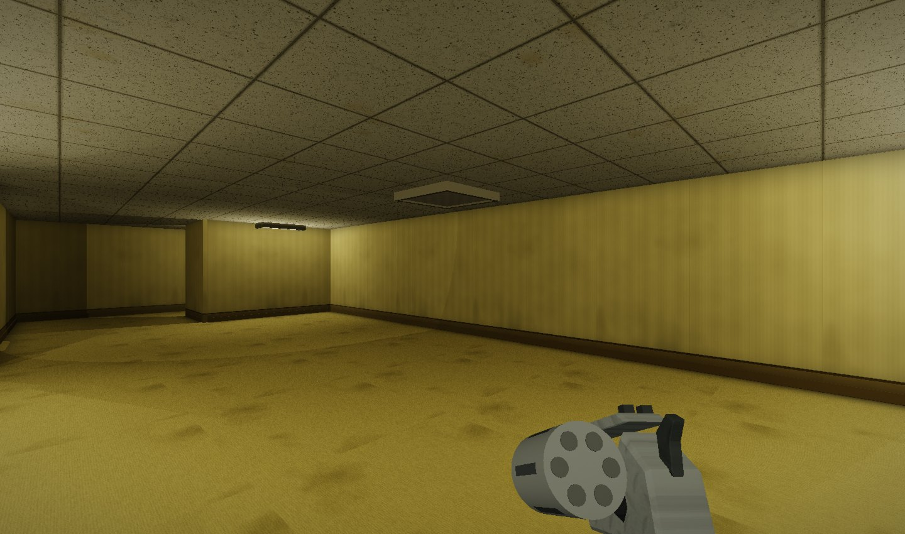

# Object realism, pass two

Based on merged main `c60492c`.

The revolver has a chamfered frame, shaped grip, oval trigger guard, rear sight
notch, chamber faces, and an independently drawn cylinder. Reloading swings the
cylinder out; ammunition count indexes its rotation. This adds one draw call
while the revolver is held. It retains the existing weapon mechanics and depth test.

Furniture shares scanned CC0 wood, fabric, and metal sources in the existing
1024x512 atlas. Wood and upholstery subparts get small bevels inside their existing
bounds. Chair upholstery now uses the fabric region. Object gloss no longer
inherits the floor's gloss, and the can has geometric smooth normals and corrected
cap-center UVs. No collision dimensions or world-generation decisions changed.

The three embedded JPEGs total 45,083 bytes. Building requires Python 3's standard
library; running the executable needs neither Python nor asset files. Sources,
license links, and conversion details are in [the material manifest](../assets/materials/README.md).

## Validation

- Native C++17 build and native regression harness passed.
- Thirteen regression captures include held items, muzzle flash, reload, wall
  clearance, chalk, a dropped deck, and couch/desk/wardrobe/cabinet sites.
- Five levels, menu, open pool hall, and flashlight captures passed shader checks
  and were visually inspected. The final can-only change was checked in the
  regression captures after the sweep.
- Mesh vertex counts in the sampled prop worlds stayed within 16-bit index limits.
- Build paths regenerate the embedded header; capture binaries run from shots/.

Interleaved A/B benchmark, best mean of three runs, after 60 warmup frames:

| Scene | Main | Updated | Ratio |
| --- | ---: | ---: | ---: |
| Level 0, seed 1337, 15/15/0.8 | 7.852 ms | 7.948 ms | 1.012 |
| Level 2, seed 1337, 15/15/0.8 | 7.601 ms | 7.634 ms | 1.004 |

These differences are small relative to run-to-run noise: treat performance as
roughly unchanged, not as a speedup. Benchmarks preceded the final can-normal/UV
fix. Local logs and full-resolution images are under shots/.

## Remaining limits

This is still a stylized custom renderer, not a full metallic/roughness PBR pipeline.
Imported sources are diffuse only; bump is derived from albedo, with gloss values
assigned per material family. The cylinder has chamber-face detail rather than a
complete internal mechanism, and reload does not animate hands or individual cases.
Not every environmental object was remodeled: shared material improvements reach
many props, while bevels target wood and fabric parts. A sustained interactive
run-around playtest remains outstanding; this pass used the native capture harness.
