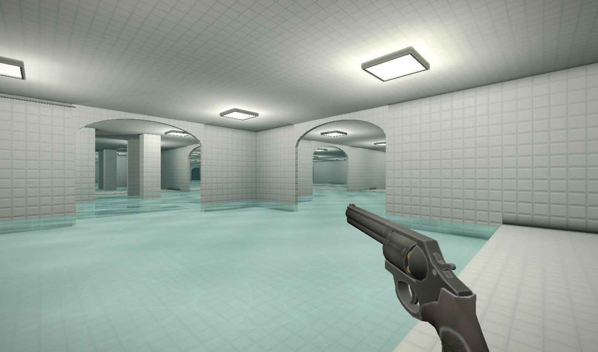
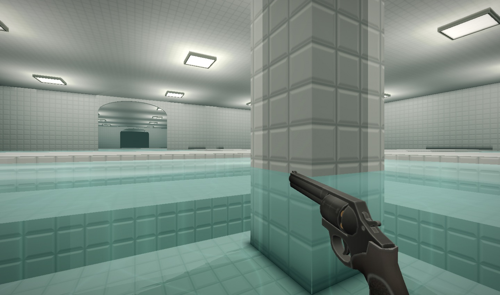
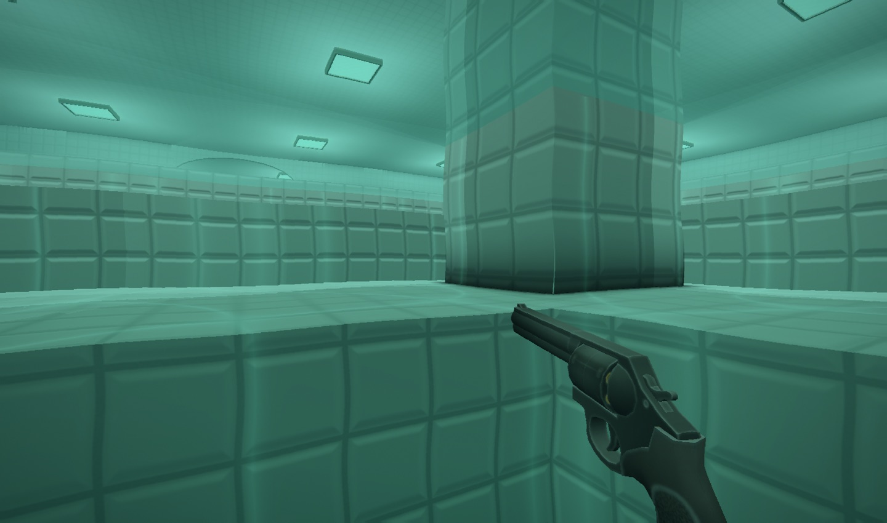

# Poolrooms: Sublimity and swimming

The visual reference is [Wikidot's Level 37, “Sublimity”](https://backrooms-wiki.wikidot.com/level-37), by egglord: pristine white ceramic, blue-green water, oversized bathing spaces and isolation. Reference images are credited there to AnarkyMusic under CC BY-SA 4.0; they were used for research, not bundled as game assets. The geometry, tile textures and water effects here remain procedural.

## In-game views







These are native game captures, not concept images.

## Design and controls

Six-metre arches connect taller halls. Shallow shelves lead to 2.8-metre-deep basin floors; some chambers stay shallow and others contain submerged column groups. The arrival landing is dry. Poolrooms no longer spawn Clark or whispers, slowly restore sanity, and retain the existing no-blackout rule. The five-level progression is unchanged.

Deep water uses damped buoyancy and water drag. Hold SPACE/JUMP to rise and float at the surface; release it to sink, which is the dive. SHIFT swims faster. Surface swimmers climb onto shelves with eased camera motion; submerged swimmers are stopped by risers. There is no breath timer. Underwater tint and subtle distortion distinguish diving, and slow stroke sounds replace footsteps while afloat.

## Verification

`make regression` checks stable floating at 30, 60 and 144 updates per second, diving, resurfacing, bottom bounds, leaving water, submerged risers, assisted climbs, full-height wall collision, entity suppression and sanity recovery. It also captures surface and underwater views.

`tools/sweep.sh` checks all five levels and the menu for shader errors and exposure. Inspect its images plus a separate pool-hall capture and flashlight capture.

Generator sample: Level 2, seed 1337, visit 1, 129 × 129 cells: 100% reachable, no disconnected pockets, no collision-buffer overflows (worst 6 of 48 boxes), roughly 75% water coverage.

```sh
tools/shot.sh pool-hall.png BACKROOMS_SEED=1337 BACKROOMS_LEVEL=2 \
    BACKROOMS_POS=65,69,0.8 BACKROOMS_CLEAN=1 BACKROOMS_TIME=4 BACKROOMS_SHOTFRAME=150
```
