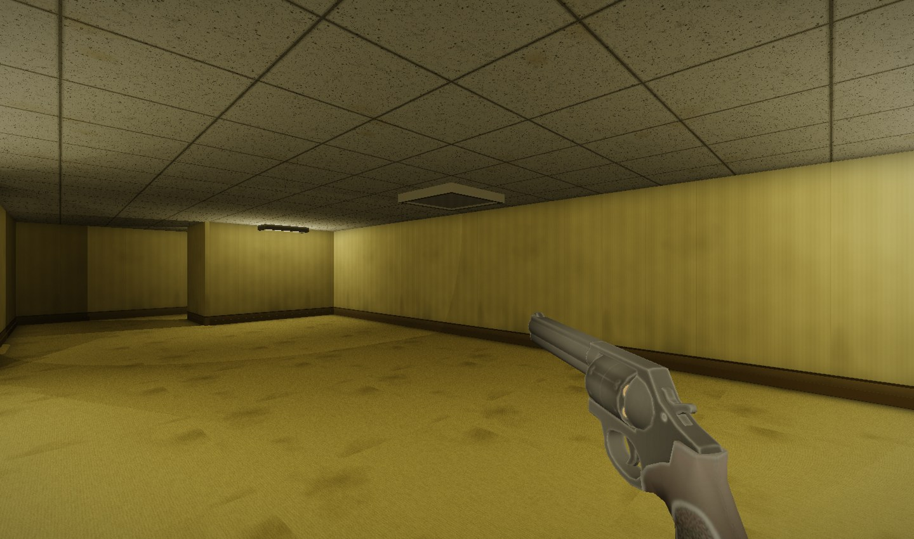
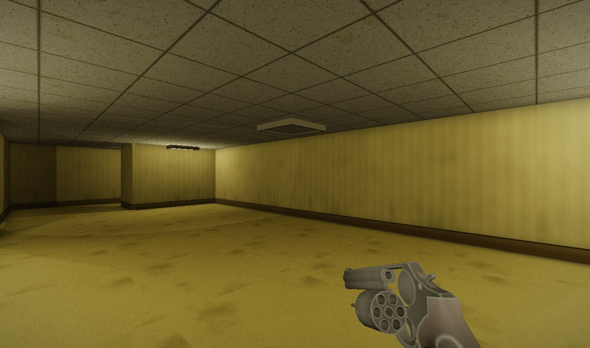

# Authored CC0 revolver

This page records the original import. The subsequent [standard model pipeline](model-pipeline.md)
replaces its custom binary/pose format with GLB and Raylib APIs.

The procedural revolver is replaced by loafbrr_1's complete gun model, with its
UVs, material detail, rigged hammer/trigger/cylinder, and firing/reload motion.
The cylinder opens to the player's left. Cartridges follow the reversed motion.
Six-round capacity, shot timing, damage, reload duration, and weapon controls
remain the same. Muzzle effects track the animated barrel.

[Asset provenance, license, and reproducible conversion](../assets/revolver/README.md).

## Rendering and cost

The gun and cartridges use two material batches: 2,334 vertices / 2,534 triangles.
The previous revolver also used two draws. Converted mesh, animation, and texture
files total about 433 KB, embedded at build time. Textures are 512 pixels with
mipmaps. Build-time embedding uses Python's standard library; only reimporting the
original archive needs NumPy/Pillow. Runtime needs neither Python nor asset files.

Poses are sampled at import and interpolated at runtime. CPU skinning updates
position/normal buffers only when the animation or ammunition index changes;
idle geometry is reused. Authored normals, roughness, and metalness are adapted
to the existing slope/gloss shader. Metallic diffuse energy is attenuated so
silver does not render as white paint. This remains an approximation, not full PBR.

## Validation

- Native build and integration regression passed, including 18 visual captures.
- Continuous reload samples remain finite and within the held-item envelope
  (maximum local radius 0.2735 m). Reload returns to its resting pose, and all
  six cylinder indices remain continuous when firing returns to idle.
- Matched before/after capture: 4.415% of pixels differ by more than 16; all such changes are confined to the lower-right weapon area, with no changes in the upper half or left half.
- Five-level/menu sweep, pool, flashlight, muzzle flash, multiple reload stages,
  and close-wall captures were visually inspected; no shader failures.
- Interleaved native Level 0 benchmark, best mean of three runs after warmup:
  previous 7.695 ms; imported 7.719 ms (1.003×). This is an idle-weapon scene
  comparison, within normal run-to-run noise, not a dedicated animation benchmark.

The source includes a six-shot Shoot action; only the first shot is played, with
accumulated cylinder indexing applied by the game. Cartridges remain in the drum
while firing and use authored reload motion; individual spent-case states and
persistent physics debris are not simulated. There are no animated hands.

## macOS startup diagnostic

A test run on September 12 crashed inside raylib 5.5's `rlglInit`, before any
assets loaded, while macOS had no active display. The previous build failed the
same way. A CoreGraphics preflight now reports a clear error and exits before
`InitWindow` when no display is active. Normal display startup passes regression;
a simulated zero-display response also exercises the error path. This addresses
that startup condition, not every possible OpenGL initialization failure.
